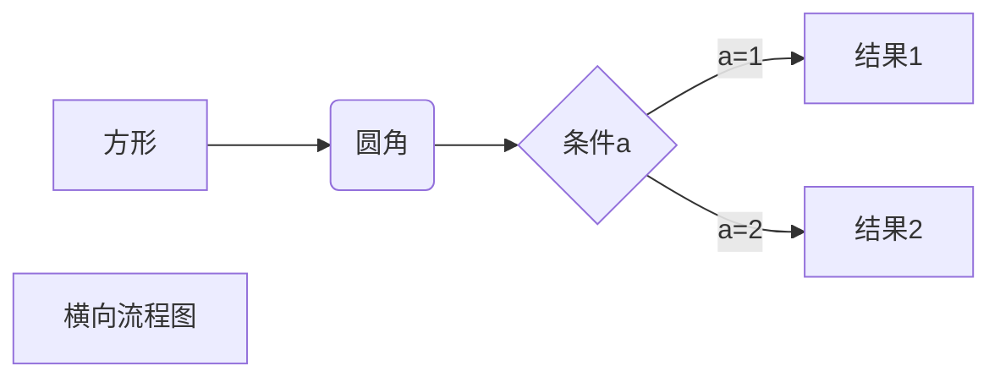
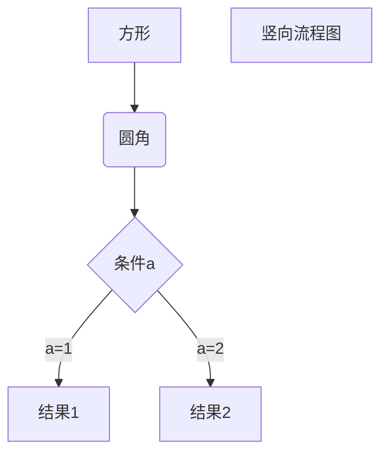
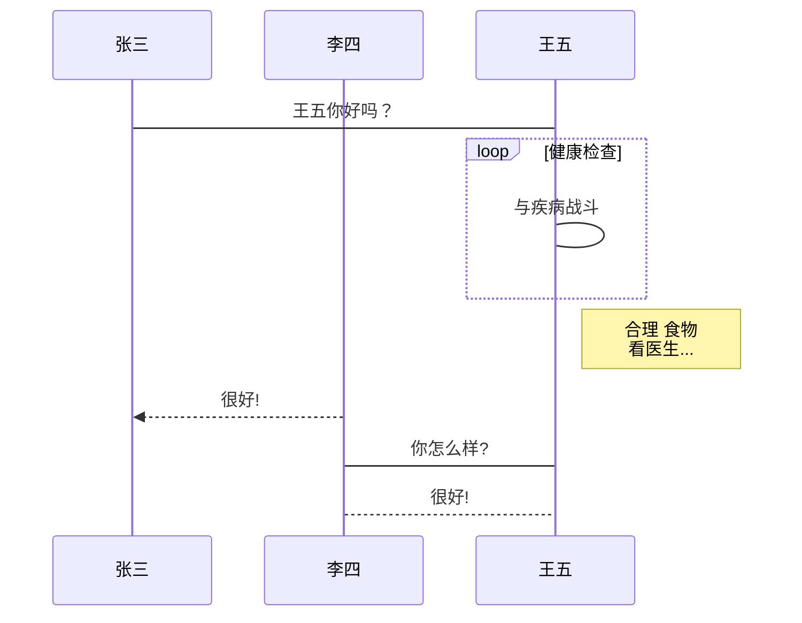
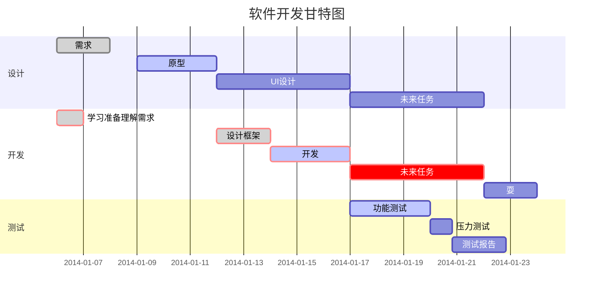
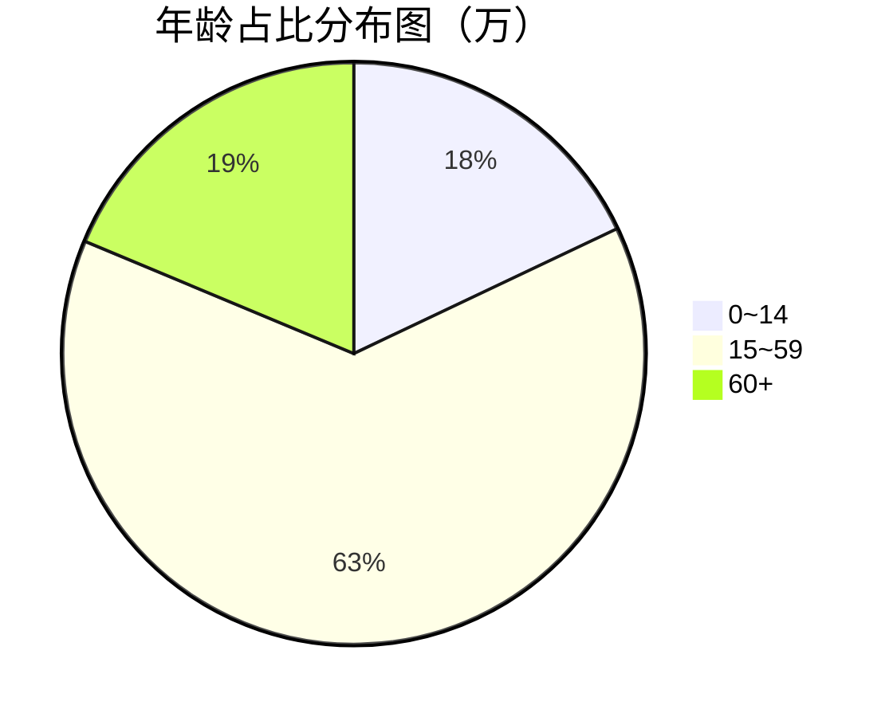

## Typora官网

[Typora.ioTypora.io](https://link.zhihu.com/?target=http%3A//Typora.io)

一、Typora基本语法指南

二、Typora图床设置篇章


## Typora简介

Typora是一款轻便简洁的Markdown编辑器，支持即时渲染技术，这也是与其他Markdown编辑器最显著的区别。即时渲染使得你写Markdown就想是写Word文档一样流畅自如，不像其他编辑器的有编辑栏和显示栏。

- Typora删除了预览窗口，以及所有其他不必要的干扰。取而代之的是实时预览。
- Markdown的语法因不同的解析器或编辑器而异，Typora使用的是GitHub Flavored Markdown。

## Markdown介绍

- Markdown 是一种轻量级标记语言，它允许人们使用易读易写的纯文本格式编写文档。
- Markdown 语言在 2004 由约翰·格鲁伯（英语：John Gruber）创建。
- Markdown 编写的文档可以导出 HTML 、Word、图像、PDF、Epub 等多种格式的文档。
- Markdown 编写的文档后缀为 `.md`, `.markdown`。


## 常用快捷键

- 加粗： `Ctrl + B`
- 撤销： `Ctrl + Z`
- 字体倾斜 ：`Ctrl+I`
- 下划线：`Ctrl+U`
- 多级标题： `Ctrl + 1~6`
- 有序列表：`Ctrl + Shift + [`
- 无序列表：`Ctrl + Shift + ]`
- 降级快捷键 ：`Tab`
- 升级快捷键：`Shift + Tab`
- 插入链接： `Ctrl + K`
- 插入公式： `Ctrl + Shift + M`
- 行内代码： `Ctrl + Shift + K`
- 插入图片： `Ctrl + Shift + I`
- 返回Typora顶部：`Ctrl+Home`
- 返回Typora底部 ：`Ctrl+End`
- 创建表格 ：`Ctrl+T`
- 选中某句话 ：`Ctrl+L`
- 选中某个单词 ：`Ctrl+D`
- 选中相同格式的文字 ：`Ctrl+E`
- 搜索: `Ctrl+F`
- 搜索并替换 ：`Ctrl+H`
- 删除线 ：`Alt+Shift+5`
- 引用 ：`Ctrl+Shift+Q`
- 生成目录：`[TOC]+Enter`

注：一些实体符号需要在实体符号之前加” \ ”才能够显示

## 菜单

输入[TOC]即可产生菜单，菜单会自动更新

## 区域元素

```text
YAML FONT Matters
```

在文章的最上方输入---，按换行键产生，然后在里面输入内容即可。

## 段落

按换行键[Enter]建立新的一行,按`Shift`+`Enter`可以创建一个比段落间距更小的行间距。可在行尾插入打断线，禁止向后插入

```text
打断线<br/>后面的内容将自动换行
```

## 标题

开头#的个数表示，空格+文字。标题有1~6个级别，#表示开始，按换行键结束

```text
# 一级标题 快捷键为 Ctrl + 1
## 二级标题 快捷键为 Ctrl + 2
......
###### 六级标题 快捷键为 Ctrl + 6
```

## 字体

斜体以**或__括住

```text
*这是斜体字体1*_这是斜体字体2_
```

*这是斜体字体1*
*这是斜体字体2*

加粗
开头`**`，结尾`**`。
或者开头`__`,结尾`__`(两个短横线)。

```text
**这是加粗字体1** __这是加粗字体2__
```

**这是加粗字体1**
__这是加粗字体2__

删除线
开头`~~`，结尾`~~`。

```text
~~这是错误文字~~
```

~~这是错误文字~~

下划线使用HTML标签<u>下划线</u>

```text
<u>下划线</u>
```

<u>下划线</u>

高亮
`==内容==`，需要自己在偏好设置里面打开这项功能

```text
==高亮==
```

==高亮==

## 代码

行内输入代码块快捷键： `Ctrl + Shift + K`

1. 开头```+语言名，开启代码块，换行键换行，光标下移键跳出
	示例：

```text
print("hello,python!"")
```

1. 用两个`在正常段落中表示代码
	例如：

```text
Use the `printf()`function.
```

Use the `printf()`function.

## 数学式

打开Typora选择数学模块

- 点击“段落”—>“公式块”
- 快捷键Ctrl+Shift+m
- `“$$”+回车`

以上三种方式都能打开数学公式的编辑栏。

示例：

```text
输入$，然后按ESC键，之后输入Tex命令，可预览
例如：
$\lim_{x\to\infty}\exp(-x)=0$
```


下标使用~~括住内容。需要自己在偏好设置里面打开这项功能

```text
H~2~O
```

H~2~O

上标

使用^括住内容。需要自己在偏好设置里面打开这项功能

```text
y^2^=4
```

y^2^=4

## 表情

Typora语法支持添加emoji表情，输入不同的符号码（两个冒号包围的字符）可以显示出不同的表情。

```text
以:开始，然后输入表情的英文单词,以：结尾，将直接输入该表情.例如：
:smile:
:cry:
:happy:
```

:smile:
:cry:
:happy:

## 表格

开头|+列名+|+列名+|+换行键，创建一个2*2表格，`Ctrl+Enter`可建立新行。

示例：

```text
|第一列|第二列|
```

## 分割线

输入 `***` 或者 `---`,按换行键换行，即可绘制一条水平线。

```text
***或---
```


------

上下是水平线


## 引用

开头>表示，空格+文字，按换行键换行，双按换行跳出

```text
> 引注1
> ···
> 引注2
>还有一行，双按换行键跳出引注模式
```

示例：

> 引注1
> ···
> 引注2
> 还有一行，双按换行键跳出引注模式

普通引用

> 空格 + 引用文字：在引用的文字前加>+空格即可，引用可以嵌套。

```text
> 引用文本前使用 [大于号+空格]
> 这行可以不加，新起一行都要加上哦
>这是引用的内容
>>这是引用的内容
```

示例：

> 引用文本前使用 [大于号+空格]
> 这行可以不加，新起一行都要加上哦
> 这是引用的内容
>
> >这是引用的内容

列表中使用

```text
* 第一项   
> 引用1    
> 引用2
* 第二项
```

示例：

- 第一项

> 引用1

> 引用2

- 第二项

引用里嵌套引用

```text
> 最外层引用
> > 多一个 
> 嵌套一层引用
> > > 可以嵌套很多层
```

> 最外层引用
> > 多一个 
> > 嵌套一层引用
> >
> > > 可以嵌套很多层

引用里嵌套列表

```text
> - 这是引用里嵌套的一个列表
> - 还可以有子列表
>     * 子列表需要从 - 之后延后四个空格开始
```

> - 这是引用里嵌套的一个列表
> - 还可以有子列表
>     * 子列表需要从 - 之后延后四个空格开始

引用里嵌套代码块

```text
>     同样的，在前面加四个空格形成代码块
> ```
> 或者使用 ``` 形成代码块
> ```
```

>     同样的，在前面加四个空格形成代码块
>     ```
>     或者使用 ``` 形成代码块
>     ```

### 脚注

在需要添加脚注的文字后面+[+^+序列+]，注释的产生可以鼠标放置其上单击自动产生，添加信息

或人工添加+[+^+序列+]+:

```text
脚注产生的方法[^footnote].
[^footnote]:这个就是"脚注"
```

脚注产生的方法[^footnote].

[^footnote]:这个就是"脚注"

## 链接

链接
输入网址，单击链接，展开后可编辑
ctr+单击，打开链接
例如：[https://www.baidu.com](https://link.zhihu.com/?target=https%3A//www.baidu.com)

常用链接方法

```text
文字链接 [链接名称](http://链接网址)网址链接 <http://链接网址>
```

示例效果：百度

超链接

格式1：用[ ]括住要超链接的内容，紧接着用( )括住超链接源+名字，超链接源后面+超链接命名
同样ctrl+单击，打开链接例如：

```text
这是[百度](https://www.baidu.com)官网
```

这是[百度](https://www.baidu.com)官网

格式2：超链接 title可加可不加

```text
This is [an example](http://example.com/ "Title") inline link.
[This link](http://example.net/) has no title attribute.
```

This is [an example](http://example.com/ "Title") inline link.
[This link](http://example.net/) has no title attribute.

高级链接技巧

使用[+超链接文字+]+[+标签+]，创建可定义链接
ctrl+单击，打开链接。

示例1：

```text
这是[百度][id][id]:https://www.baidu.com
```

这是[百度][id][id]:https://www.baidu.com

示例2：

```text
这个链接用 1 作为网址变量 [Google][1].
这个链接用 yahoo 作为网址变量 [Yahoo!][yahoo].
然后在文档的结尾为变量赋值（网址）  
[1]: http://www.google.com/  
[yahoo]: http://www.yahoo.com/
```

这个链接用 1 作为网址变量 [Google][1].
这个链接用 yahoo 作为网址变量 [Yahoo!][yahoo].
然后在文档的结尾为变量赋值（网址）  

[1]: http://www.google.com/
[yahoo]: http://www.yahoo.com/

## URLs

用<>括住url，可手动设置url对于标准URLs，可自动识别

```text
<www.baidu.com>
```

<www.baidu.com>

## 序列

开头*/+/- 加空格+文字，可以创建无序序列，换行键换行，删除键+shift+tab跳出
开头1.加空格+后接文字，可以创建有序序列例：

- 第一个无序序列
- 第二个无序序列
- ······

1. 第一个有序序列
2. 第二个有序序列
3. ······

可选序列

开头序列+空格+[ ]+空格+文字，换行键换行，删除键+shift+tab跳出例如：

```text
- [ ] 第一个可选序列
- [ ] 第二个可选序列
- [ ] 第三个可选序列
- [x] 第四个可选序列
```

- [ ] 第一个可选序列
- [ ] 第二个可选序列
- [ ] 第三个可选序列
- [x] 第四个可选序列

总结：先输入减号，然后输入空格，之后就变成了黑色圆点，在输入[]，在中间加个空格，回车就可以注：任务列表无快捷键，可以点击菜单栏段落，任务列表。

## 图片

> Typora文本文档中有使用图片内容，如果需要发布在各个兼容Markdown的软件平台，需要预先上传文档中的图片至图床，再通过对图床的图片链接调用，才能正常显示，否则各个平台将无法看到该文档图片。
> 免费图床网址：[https://sm.ms/](https://link.zhihu.com/?target=https%3A//sm.ms/)图床设置：[Typora图床自动上传图片设置篇]

1. 手动添加：跟链接的方法区别在于前面加了个感叹号 `!`，这样是不是觉得好记多了呢？

```text

```

1. 当然，你也可以像网址那样对图片网址使用变量

```text
这个链接用 1 作为网址变量 [Google][1].
然后在文档的结尾位变量赋值（网址） 

[1]: http://www.google.com/logo.png
```

这个链接用 1 作为网址变量 [Google][1].
然后在文档的结尾位变量赋值（网址） 

[1]: http://www.google.com/logo.png

1. 除了以上2种方式之外，还可以直接将图片拖拽进来，自动生成链接。

```text


```

## Typora图床设置

Typora文本文档中有使用图片内容，如果需要发布在各个兼容Markdown的软件平台，需要预先上传文档中的图片至图床，再通过对图床的图片链接调用，才能正常显示，否则各个平台将无法看到该文档图片。

> 图床意义：就是专门用来存放图片，同时允许你把图片对外连接的网上空间，不少图床都是免费的。

图床工具，就是自动把本地图片转换成链接的一款工具，网络上有很多图床工具。

Typora文件偏好属性>上传服务设定>选择PicGo-Core（command line>选择下载更新如图一

图一

图二为更新下载完成状态

图二

图三打开配置文件后的文件config.json

图三

图四为图床网站，自己注册新的账号

图四


如图图五找到账号中相应的token，若没有，生成即可

图五

按照图六格式添加相应的内容代码后保存

六

回到偏好设置如图一中的验证图片上传选项功能，若出现图七提示，说明，图床自动上传功能设置成功。

图七

1. 这个就是脚注 ↩


<!--
### 账号

* 账号：qinzhengquan
* 密码：gavenqin123456 
-->


## 支持的 HTML 元素

不在 Markdown 涵盖范围之内的标签，都可以直接在文档里面用 HTML 撰写。

目前支持的 HTML 元素有：`<kbd> <b> <i> <em> <sup> <sub> <br>`等 ，如：

```
使用 <kbd>Ctrl</kbd>+<kbd>Alt</kbd>+<kbd>Del</kbd> 重启电脑
```

使用 <kbd>Ctrl</kbd>+<kbd>Alt</kbd>+<kbd>Del</kbd> 重启电脑

## 转义

Markdown 使用了很多特殊符号来表示特定的意义，如果需要显示特定的符号则需要使用转义字符，Markdown 使用反斜杠转义特殊字符：

**文本加粗** 
\*\* 正常显示星号 \*\*

Markdown 支持以下这些符号前面加上反斜杠来帮助插入普通的符号

```
\   反斜线
`   反引号
*   星号
_   下划线
{}  花括号
[]  方括号
()  小括号
#   井字号
+   加号
-   减号
.   英文句点
!   感叹号
```


## 公式

当你需要在编辑器中插入数学公式时，可以使用两个美元符 $$ 包裹 TeX 或 LaTeX 格式的数学公式来实现。提交后，问答和文章页会根据需要加载 Mathjax 对数学公式进行渲染。如：

```
$$
\mathbf{V}_1 \times \mathbf{V}_2 =  \begin{vmatrix} 
\mathbf{i} & \mathbf{j} & \mathbf{k} \\
\frac{\partial X}{\partial u} &  \frac{\partial Y}{\partial u} & 0 \\
\frac{\partial X}{\partial v} &  \frac{\partial Y}{\partial v} & 0 \\
\end{vmatrix}
${$tep1}{\style{visibility:hidden}{(x+1)(x+1)}}
$$
```

输出结果为：
$$
\mathbf{V}_1 \times \mathbf{V}_2 =  \begin{vmatrix} 
\mathbf{i} & \mathbf{j} & \mathbf{k} \\
\frac{\partial X}{\partial u} &  \frac{\partial Y}{\partial u} & 0 \\
\frac{\partial X}{\partial v} &  \frac{\partial Y}{\partial v} & 0 \\
\end{vmatrix}
${$tep1}{\style{visibility:hidden}{(x+1)(x+1)}}
$$

## 画图

**1、横向流程图源码格式：**

```
```mermaid
graph LR
A[方形] -->B(圆角)
    B --> C{条件a}
    C -->|a=1| D[结果1]
    C -->|a=2| E[结果2]
    F[横向流程图]
​```
```



**2、竖向流程图源码格式：**

```
```mermaid
graph TD
A[方形] --> B(圆角)
    B --> C{条件a}
    C --> |a=1| D[结果1]
    C --> |a=2| E[结果2]
    F[竖向流程图]
​```
```



**3、标准流程图源码格式：**

```
```flow
st=>start: 开始框
op=>operation: 处理框
cond=>condition: 判断框(是或否?)
sub1=>subroutine: 子流程
io=>inputoutput: 输入输出框
e=>end: 结束框
st->op->cond
cond(yes)->io->e
cond(no)->sub1(right)->op
​```
```

```flow
st=>start: 开始框
op=>operation: 处理框
cond=>condition: 判断框(是或否?)
sub1=>subroutine: 子流程
io=>inputoutput: 输入输出框
e=>end: 结束框
st->op->cond
cond(yes)->io->e
cond(no)->sub1(right)->op
```

**4、标准流程图源码格式（横向）：**

```
```flow
st=>start: 开始框
op=>operation: 处理框
cond=>condition: 判断框(是或否?)
sub1=>subroutine: 子流程
io=>inputoutput: 输入输出框
e=>end: 结束框
st(right)->op(right)->cond
cond(yes)->io(bottom)->e
cond(no)->sub1(right)->op
​```
```

```sequence
对象A->对象B: 对象B你好吗?（请求）
Note right of 对象B: 对象B的描述
Note left of 对象A: 对象A的描述(提示)
对象B-->对象A: 我很好(响应)
对象A->对象B: 你真的好吗？
```

**5、UML时序图源码样例：**

```
```sequence
对象A->对象B: 对象B你好吗?（请求）
Note right of 对象B: 对象B的描述
Note left of 对象A: 对象A的描述(提示)
对象B-->对象A: 我很好(响应)
对象A->对象B: 你真的好吗？
​```
```

```sequence
对象A->对象B: 对象B你好吗?（请求）
Note right of 对象B: 对象B的描述
Note left of 对象A: 对象A的描述(提示)
对象B-->对象A: 我很好(响应)
对象A->对象B: 你真的好吗？
```

**6、UML时序图源码复杂样例：**

```
```sequence
Title: 标题：复杂使用
对象A->对象B: 对象B你好吗?（请求）
Note right of 对象B: 对象B的描述
Note left of 对象A: 对象A的描述(提示)
对象B-->对象A: 我很好(响应)
对象B->小三: 你好吗
小三-->>对象A: 对象B找我了
对象A->对象B: 你真的好吗？
Note over 小三,对象B: 我们是朋友
participant C
Note right of C: 没人陪我玩
​```
```

```sequence
Title: 标题：复杂使用
对象A->对象B: 对象B你好吗?（请求）
Note right of 对象B: 对象B的描述
Note left of 对象A: 对象A的描述(提示)
对象B-->对象A: 我很好(响应)
对象B->小三: 你好吗
小三-->>对象A: 对象B找我了
对象A->对象B: 你真的好吗？
Note over 小三,对象B: 我们是朋友
participant C
Note right of C: 没人陪我玩
```

**7、UML标准时序图样例：**

```
```mermaid
%% 时序图例子,-> 直线，-->虚线，->>实线箭头
  sequenceDiagram
    participant 张三
    participant 李四
    张三->王五: 王五你好吗？
    loop 健康检查
        王五->王五: 与疾病战斗
    end
    Note right of 王五: 合理 食物 <br/>看医生...
    李四-->>张三: 很好!
    王五->李四: 你怎么样?
    李四-->王五: 很好!
​```
```



**8、甘特图样例：**

```
```mermaid
%% 语法示例
        gantt
        dateFormat  YYYY-MM-DD
        title 软件开发甘特图
        section 设计
        需求                      :done,    des1, 2014-01-06,2014-01-08
        原型                      :active,  des2, 2014-01-09, 3d
        UI设计                     :         des3, after des2, 5d
    未来任务                     :         des4, after des3, 5d
        section 开发
        学习准备理解需求                      :crit, done, 2014-01-06,24h
        设计框架                             :crit, done, after des2, 2d
        开发                                 :crit, active, 3d
        未来任务                              :crit, 5d
        耍                                   :2d
        section 测试
        功能测试                              :active, a1, after des3, 3d
        压力测试                               :after a1  , 20h
        测试报告                               : 48h
​```
```






